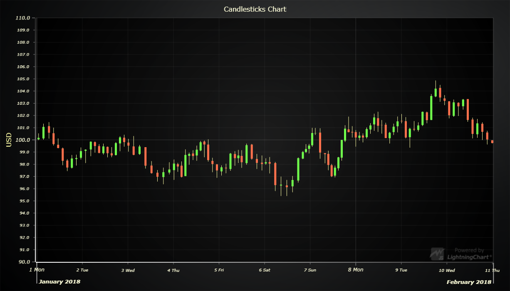

# Candlestick Chart



This demo application belongs to the set of examples for LightningChart JS, data visualization library for JavaScript.

LightningChart JS is entirely GPU accelerated and performance optimized charting library for presenting massive amounts of data. It offers an easy way of creating sophisticated and interactive charts and adding them to your website or web application.

The demo can be used as an example or a seed project. Local execution requires the following steps:

- Make sure that relevant version of [Node.js](https://nodejs.org/en/download/) is installed
- Open the project folder in a terminal:

        npm install              # fetches dependencies
        npm start                # builds an application and starts the development server

- The application is available at *http://localhost:8080* in your browser, webpack-dev-server provides hot reload functionality.


## Description

*Also known as Japanese Candlestick Chart*

This example shows basic implementation of candlestick chart using OHLCSeries. This type of chart is used as a trading tool to visualize price movements. A candlestick figure can represent multiple recorded values, which are packed into 4 values (open, high, low and close). This makes it useful for dynamically displaying data from longer intervals as well as shorter.

OHLCSeries are created using ChartXY method.

```javascript
const chart = lightningChart().ChartXY()
// Method for adding OHLCSeries takes one argument: seriesConstructor.
const ohlcSeries = chart.addOHLCSeries(
    // Specify type of figure used
    { seriesConstructor: OHLCFigures.Candlestick }
)
```

OHLCSeries accept data in the form of interface 'XOHLC':

```javascript
const xohlc = [
    // X-position
    0,
    // Opening Y-value
    100,
    // Highest Y-value
    200,
    // Lowest Y-value
    50,
    // Closing Y-value
    75
]
// Add new segment to series.
ohlcSeries.add(xohlc)
```

add() can be called with a single XOHLC-object or with an array of them.

## Anatomy of a candlestick figure

Candlesticks are formed from two parts: *Body* and *Line*s. Both of these can be individually styled.

[//]: # "IMPORTANT: The assets will not show before README.md is built - relative path is different!"


## API Links

* [XY cartesian chart]
* [Axis tick strategies]
* [Figure types]
* [OHLC series]
* [XOHLC datastructure]
* [OHLC generator]


## Support

If you notice an error in the example code, please open an issue on [GitHub][0] repository of the entire example.

Official [API documentation][1] can be found on [Arction][2] website.

If the docs and other materials do not solve your problem as well as implementation help is needed, ask on [StackOverflow][3] (tagged lightningchart).

If you think you found a bug in the LightningChart JavaScript library, please contact support@arction.com.

Direct developer email support can be purchased through a [Support Plan][4] or by contacting sales@arction.com.

[0]: https://github.com/Arction/
[1]: https://www.arction.com/lightningchart-js-api-documentation/
[2]: https://www.arction.com
[3]: https://stackoverflow.com/questions/tagged/lightningchart
[4]: https://www.arction.com/support-services/

© Arction Ltd 2009-2020. All rights reserved.


[XY cartesian chart]: https://www.arction.com/lightningchart-js-api-documentation/v2.0.0/classes/chartxy.html
[Axis tick strategies]: https://www.arction.com/lightningchart-js-api-documentation/v2.0.0/globals.html#axistickstrategies
[Figure types]: https://www.arction.com/lightningchart-js-api-documentation/v2.0.0/globals.html#ohlcfigures
[OHLC series]: https://www.arction.com/lightningchart-js-api-documentation/v2.0.0/classes/chartxy.html#addohlcseries
[XOHLC datastructure]: https://www.arction.com/lightningchart-js-api-documentation/v2.0.0/globals.html#xohlc
[OHLC generator]: https://arction.github.io/xydata/classes/ohlcgenerator.html

